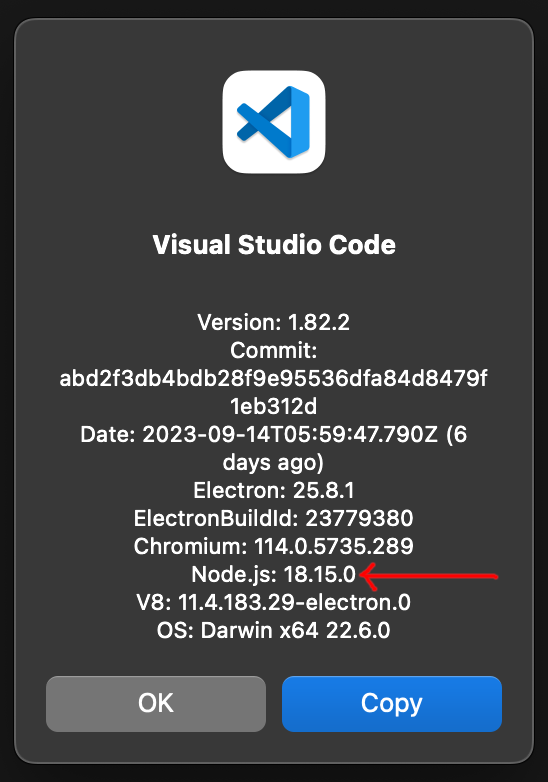

# Node version

> [!NOTE]
> It should not be necessary to update the Node.js version manually. The [update-node-version.yml](https://github.com/github/vscode-codeql/blob/main/.github/workflows/update-node-version.yml) workflow runs daily and will open a pull request if the Node.js version needs to be updated.

The CodeQL for VS Code extension defines the version of Node.js that it is intended to run with. This Node.js version is used when running most CI and unit tests.

When running in production (i.e. as an extension for a VS Code application) it will use the Node.js version provided by VS Code. This can mean a different Node.js version is used by different users with different versions of VS Code.
We should make sure the CodeQL for VS Code extension works with the Node.js version supplied by all versions of VS Code that we support.

## Checking the version of Node.js supplied by VS Code

You can find this info by selecting "About Visual Studio Code" from the top menu.



## Updating the Node.js version

To update the Node.js version, run:

```bash
npx ts-node scripts/update-node-version.ts
```

## Node.js version used in tests

Unit tests will use whatever version of Node.js is installed locally. In CI this will be the version specified in the workflow.

Integration tests download a copy of VS Code and then will use whatever version of Node.js is provided by VS Code. See [VS Code version used in tests](./vscode-version.md#vs-code-version-used-in-tests) for more information.
