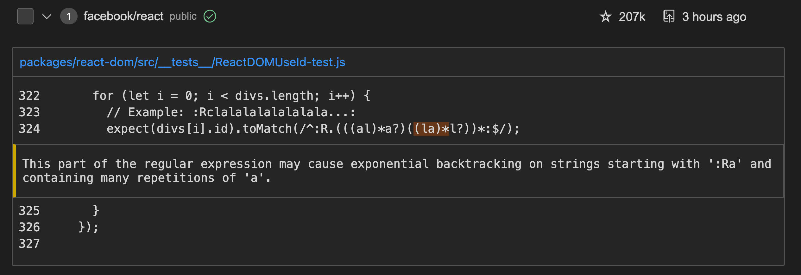
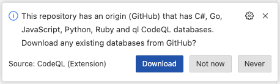

# Test Plan

This document describes the manual test plan for the QL extension for Visual Studio Code.

The plan will be executed manually to start with but the goal is to eventually automate parts of the process (based on
effort vs value basis).

## What this doesn't cover

We don't need to test features (and permutations of features) that are covered by automated tests.

## Before releasing the VS Code extension

- Run at least one local query and MRVA using the existing version of the extension (to generate "old" query history items).
- Go through the required test cases listed below.
- Check major PRs since the previous release for specific one-off things to test. Based on that, you might want to
choose to go through some of the Optional Test Cases.

## Required Test Cases

### Local databases

#### Test case 1: Download a database from GitHub

1. Click "Download Database from GitHub" and enter `angular-cn/ng-nice` and select the javascript language if prompted

#### Test case 2: Import a database from an archive

1. Obtain a javascript database for `babel/babel`
   - You can do `gh api "/repos/babel/babel/code-scanning/codeql/databases/javascript" -H "Accept: application/zip" > babel.zip` to fetch a database from GitHub.
2. Click "Choose Database from Archive" and select the file you just downloaded above.

### Local queries

#### Test case 1: Running a path problem query and viewing results

1. Open the [javascript UnsafeJQueryPlugin query](https://github.com/github/codeql/blob/main/javascript/ql/src/Security/CWE-079/UnsafeJQueryPlugin.ql).
2. Select the `angular-cn/ng-nice` database (or download it if you don't have one already)
3. Run a local query.
4. Once the query completes:
   - Check that the result messages are rendered
   - Check that the paths can be opened and paths are rendered correctly
   - Check that alert locations can be clicked on

#### Test case 2: Running a problem query and viewing results

1. Open the [javascript ReDoS query](https://github.com/github/codeql/blob/main/javascript/ql/src/Performance/ReDoS.ql).
2. Select the `babel/babel` database (or download it if you don't have one already)
3. Run a local query.
4. Once the query completes:
   - Check that the result messages are rendered
   - Check that alert locations can be clicked on

#### Test case 3: Running a non-problem query and viewing results

1. Open the [cpp HubClasses query](https://github.com/github/codeql/blob/main/cpp/ql/src/Architecture/General%20Class-Level%20Information/HubClasses.ql).
2. Select the `google/brotli` database (or download it if you don't have one already)
3. Run a local query.
4. Once the query completes:
   - Check that the `#select` result set is shown
   - Check that the results table is rendered
   - Check that result locations can be clicked on

#### Test case 4: Can use AST viewer

1. Click on any code location from a previous query to open a source file from a database
2. Select the highlighted code in the source file
3. Open the AST viewing panel and click "View AST"
4. Once the AST is computed:
   - Check that it can be navigated

### MRVA

#### Test Case 1: Running a path problem query and viewing results

1. Open the [javascript UnsafeJQueryPlugin query](https://github.com/github/codeql/blob/main/javascript/ql/src/Security/CWE-079/UnsafeJQueryPlugin.ql).
2. Run a MRVA against the following repo list:

   ```json
   {
      "name": "test-repo-list",
      "repositories": [
         "angular-cn/ng-nice",
         "apache/hadoop",
         "apache/hive"
      ]
   }
   ```

3. Check that a notification message pops up and the results view is opened.
4. Check the query history. It should:
   - Show that an item has been added to the query history
   - The item should be marked as "in progress".
5. Once the query starts:
   - Check the results view
   - Check the code paths view, including the code paths drop down menu.
   - Check that the repository filter box works
   - Click links to files/locations on GitHub
   - Check that the query history item is updated to show the number of results
6. Once the query completes:
   - Check that the query history item is updated to show the query status as "complete"

#### Test Case 2: Running a problem query and viewing results

1. Open the [javascript ReDoS query](https://github.com/github/codeql/blob/main/javascript/ql/src/Performance/ReDoS.ql).
2. Run a MRVA against the "Top 10" repositories.
3. Check that a notification message pops up and the results view is opened.
4. Check the query history. It should:
   - Show that an item has been added to the query history
   - The item should be marked as "in progress".
5. Once the query completes:
   - Check that the results are rendered with an alert message and a highlighted code snippet:

   

#### Test Case 3: Running a non-problem query and viewing results

1. Open the [cpp FunLinesOfCode query](https://github.com/github/codeql/blob/main/cpp/ql/src/Metrics/Functions/FunLinesOfCode.ql).
2. Run a MRVA against a single repository (e.g. `google/brotli`).
3. Check that a notification message pops up and the results view is opened.
4. Check the query history. It should:
   - Show that an item has been added to the query history
   - The item should be marked as "in progress".
5. Once the query completes:
   - Check that the results show up in a table:

   

#### Test Case 4: Interacting with query history

1. Click a history item (for MRVA):
   - Check that exporting results works
   - Check that sorting results works
   - Check that copying repo lists works
2. Click "Open Results Directory":
   - Check that the correct directory is opened and there are results in it
3. Click "View Logs":
   - Check that the correct workflow is opened

#### Test Case 5: Canceling a variant analysis run

Run one of the above MRVAs, but cancel it from within VS Code:

- Check that the query is canceled and the query history item is updated.
- Check that the workflow run is also canceled.
- Check that any available results are visible in VS Code.

#### Test Case 6: Using model packs in MRVA

1. Create a model pack with mock data
   1. Create a new directory `test-model-pack`
   2. Create a `qlpack.yml` file in that directory with the following contents:

      ```yaml
      name: github/test-model-pack
      version: 0.0.0
      library: true
      extensionTargets:
        codeql/python-all: '*'
      dataExtensions:
        - extension.yml
      ```

   3. Create an `extension.yml` in the same directory with the following contents:

      ```yaml
      extensions:
      - addsTo:
          pack: codeql/python-all
          extensible: sinkModel
        data:
         - ["vscode-codeql","Member[initialize].Argument[0]","code-injection"]
      ```

2. In a Python query pack, create the following query (e.g. `sinks.ql`):

   ```ql
   import python
   import semmle.python.frameworks.data.internal.ApiGraphModelsExtensions

   from string path, string kind
   where sinkModel("vscode-codeql", path, kind, _)
   select path, kind
   ```

3. Run a MRVA against a Python repository (e.g. `psf/requests`) with this query.
4. Check that the results view contains 1 result with the values corresponding to the `extension.yml` file:
   

### CodeQL Model Editor

#### Test Case 1: Opening the model editor

1. Download the `sofastack/sofa-jraft` java database from GitHub.
2. Open the Model Editor with the "CodeQL: Open CodeQL Model Editor" command from the command palette.
   - Check that the editor loads and shows methods to model.
   - Check that methods are grouped per library (e.g. `rocksdbjni@7.7.3` or `asm@6.0`)
   - Check that the "Open source" link works (if you have the database source).
   - Check that the 'View' button works and the Method Usage panel highlight the correct method and usage
   - Check that the Method Modeling panel shows the correct method and modeling state

#### Test Case 2: Model methods

1. Expand one of the libraries.
   - Change the model type and check that the other dropdowns change.
   - Check that the method modeling panel updates accordingly
2. Save the modeled methods.
3. Click "Open extension pack"
   - Check that the file explorer opens a directory with a "models" directory
4. Open the ".model.yml" file corresponding to the library that was changed.
   - Check that the file contains entries for the methods that were modeled.

#### Test Case 3: Model as dependency

Note that this test requires the feature flag: `codeQL.model.flowGeneration`

1. Click "Model as dependency"
   - Check that grouping are now per package (e.g. `com.alipay.sofa.rraft.option` or `com.google.protobuf`)
2. Click "Generate".
   - Check that rows are filled out.

### GitHub database download

#### Test case 1: Download a database

Open a clone of the [`github/codeql`](https://github.com/github/codeql) repository as a folder.

1. Wait a few seconds until the CodeQL extension is fully initialized.
   - Check that the following prompt appears:

     

   - If the prompt does not appear, ensure that the `codeQL.githubDatabase.download` setting is not set in workspace or user settings.

2. Click "Download".
3. Select the "C#" and "JavaScript" databases.
   - Check that there are separate notifications for both downloads.
   - Check that both databases are added when the downloads are complete.

### General

#### Test case 1: Change to a different colour theme

Open at least one of the above MRVAs and at least one local query, then try changing to a different colour theme and check that everything looks sensible.
Are there any components that are not showing up?

## Optional Test Cases

### Modeling Flow

1. Check that a method can have multiple models:
   - Add a couple of new models for one method in the model editor
   - Save and check that the modeling file (use the 'open extension pack' button to open it) shows multiple methods
   - Check that the Method Modeling Panel shows the correct multiple models
   - Check that you can browse through different models in the Method Modeling Panel
   - Check that a 'duplicated classification' error appears in both model editor and modeling panel when a duplicate modeling occurs
   - Check that a 'conflicting classification' error appears when a neutral model type is paired with a model of the same kind
   - Check that clicking on the error highlights the correct modeling in both the editor and the modeling panel
2. Check the Method Usage Panel
   - Check that the Method Usage Panel opens and jumps to the correct usage when clicking on 'View' in the model editor
   - Check that the first and following usages are opening when clicking on a usage
   - Check that the usage icon color turns green when saving a newly modeled method
   - Check that the usage icon color turns red when saving a newly unmodeld method
3. Check the Method Modeling Panel
   - Check that the 'Start modeling' button opens a new model editor
   - Check that it refreshes the blank state when a model editor is opened/closed
   - Check that when modeling in the editor the modeling panel updates accordingly
   - Check that when modeling in the modeling panel the model editor updates accordingly

### Selecting MRVA repositories to run on

#### Test case 1: Running a query on a single repository

1. When the repository exists and is public
   1. Has a CodeQL database for the correct language
   2. Has a CodeQL database for another language
   3. Does not have any CodeQL databases
2. When the repository exists and is private
   1. Is accessible and has a CodeQL database
   2. Is not accessible
3. When the repository does not exist

#### Test case 2: Running a query on a custom repository list

1. The repository list is non-empty
   1. All repositories in the list have a CodeQL database
   2. Some but not all repositories in the list have a CodeQL database
   3. No repositories in the list have a CodeQL database
2. The repository list is empty

#### Test case 3: Running a query on all repositories in an organization

1. The org exists
   1. The org contains repositories that have CodeQL databases
   2. The org contains repositories of the right language but without CodeQL databases
   3. The org contains repositories not of the right language
   4. The org contains private repositories that are inaccessible
2. The org does not exist

### Using different types of controller repos for MRVA

#### Test case 1: Running a query when the controller repository is public

1. Can run queries on public repositories
2. Can not run queries on private repositories

#### Test case 2: Running a query when the controller repository is private

1. Can run queries on public repositories
2. Can run queries on private repositories

#### Test case 3: Running a query when the controller repo exists but you do not have write access

1. Cannot run queries

#### Test case 4: Running a query when the controller repo doesn’t exist

1. Cannot run queries

#### Test case 5: Running a query when the "config field" for the controller repo is not set

1. Cannot run queries

### Query History

This requires running a MRVA query and viewing the query history.

The first test case specifies actions that you can do when the query is first run and is in "pending" state. We start
with this since it has quite a limited number of actions you can do.

#### Test case 1: When variant analysis state is "pending"

1. Starts monitoring variant analysis
2. Cannot open query history item
3. Can delete a query history item
   1. Item is removed from list in UI
   2. Files on dist are deleted (can get to files using "open query directory")
4. Can sort query history items
   1. By name
   2. By query date
   3. By result count
5. Cannot open query directory
6. Can open query that produced these results
   1. When the file still exists and has not moved
   2. When the file does not exist
7. Cannot view logs
8. Cannot copy repository list
9. Cannot export results
10. Cannot select to create a gist
11. Cannot select to save as markdown
12. Cannot cancel analysis

#### Test case 2: When the variant analysis state is not "pending"

1. Query history is loaded when VSCode starts
2. Handles when action workflow was canceled while VSCode was closed
3. Can open query history item
    1. Manually by clicking on them
    2. Automatically when VSCode starts (if they were open when VSCode was last used)
4. Can delete a query history item
    1. Item is removed from list in UI
    2. Files on dist are deleted (can get to files using "open query directory")
5. Can sort query history items
    1. By name
    2. By query date
    3. By result count
6. Can open query directory
7. Can open query that produced these results
    1. When the file still exists and has not moved
    2. When the file does not exist
8. Can view logs
9. Can copy repository list
   1. Text is copied to clipboard
   2. Text is a valid repository list
10. Can export results
11. Can select to create gist
    1. A gist is created
    2. The first thing in the gist is a summary
    3. Contains a file for each repository with results
    4. A popup links you to the gist
12. Can select to save as markdown
    1. A directory is created on disk
    2. Contains a summary file
    3. Contains a file for each repository with results
    4. A popup allows you to open the directory

#### Test case 3: When variant analysis state is "in_progress"

1. Starts monitoring variant analysis
   1. Ready results are downloaded
2. Can cancel analysis
   1. Causes the actions run to be canceled

#### Test case 4: When variant analysis state is in final state ("succeeded"/"failed"/"canceled")

1. Stops monitoring variant analysis
   1. All results are downloaded if state is succeeded
   2. Otherwise, ready results are downloaded, if any are available
2. Cannot cancel analysis

### MRVA results view

This requires running a MRVA query and seeing the results view.

<!-- markdownlint-disable-next-line MD024 -->
#### Test case 1: When variant analysis state is "pending"

1. Can open a results view
2. Results view opens automatically
   - When starting variant analysis run
   - When VSCode opens (if view was open when VSCode was closed)
3. Results view is empty

#### Test case 2: When variant analysis state is not "pending"

1. Can open a results view
2. Results view opens automatically
   1. When starting variant analysis run
   2. When VSCode opens (if view was open when VSCode was closed)
3. Can copy repository list
   1. Text is copied to clipboard
   2. Text is a valid repository list
4. Can export results
   1. Only includes repos that you have selected (also see section from query history)
5. Can cancel analysis
6. Can open query file
   1. When the file still exists and has not moved
   2. When the file does not exist
7. Can open query text
8. Can sort repos
   1. Alphabetically
   2. By number of results
   3. By popularity
9. Can filter repos
10. Shows correct statistics
    1. Total number of results
    2. Total number of repositories
    3. Duration
11. Can see live results
    1. Results appear in extension as soon as each query is completed
12. Can view interpreted results (i.e. for a "problem" query)
    1. Can view non-path results
    2. Can view code paths for "path-problem" queries
13. Can view raw results (i.e. for a non "problem" query)
    1. Renders a table
14. Can see skipped repositories
    1. Can see repos with no db in a tab
       1. Shown warning that explains the tab
    2. Can see repos with no access in a tab
       1. Shown warning that explains the tab
    3. Only shows tab when there are skipped repos
15. Result downloads
    1. All results are downloaded automatically
    2. Download status is indicated by a spinner (Not currently any indication of progress beyond "downloading" and "not downloading")
    3. Only 3 items are downloaded at a time
    4. Results for completed queries are still downloaded when
       1. Some but not all queries failed
       2. The variant analysis was canceled after some queries completed

#### Test case 3: When variant analysis state is in "succeeded" state

1. Can view logs
2. All results are downloaded

#### Test case 4: When variant analysis is in "failed" or "canceled" state

1. Can view logs
1. Results for finished queries are still downloaded.

### MRVA repositories panel

1. Add a list
1. Add a database at the top level
1. Add a database to a list
1. Add a the same database at a top-level and in a list
1. Delete a list
1. Delete a database from the top level
1. Delete a database from a list
1. Add an owner
1. Remove an owner
1. Rename a list
1. Open on GitHub
1. Select a list (via "Select" button and via context menu action)
1. Run MRVA against a user-defined list
1. Run MRVA against a top-N list
1. Run MRVA against an owner
1. Run MRVA against a database
1. Copy repo list
1. Open config file
1. Make changes via config file (ensure JSON schema is helping out)
1. Close and re-open VS Code (ensure lists are there)
1. Collapse/expand tree nodes
1. Create a new list, right click and select "Add repositories with GitHub Code Search". Enter the language 'python' and the query "UserMixin". This should show a rate limiting notification after a while but eventually populate the list with roughly 770 items.

Error cases that trigger an error notification:

1. Try to add a list with a name that already exists
1. Try to add a top-level database that already exists
1. Try to add a database in a list that already exists in the list

Error cases that show an error in the panel (and only the edit button should be visible):

1. Edit the db config file directly and save invalid JSON
1. Edit the db config file directly and save valid JSON but invalid config (e.g. add an unknown property)
1. Edit the db config file directly and save two lists with the same name

Cases where there the welcome view is shown:

1. No controller repo is set in the user's settings JSON.
