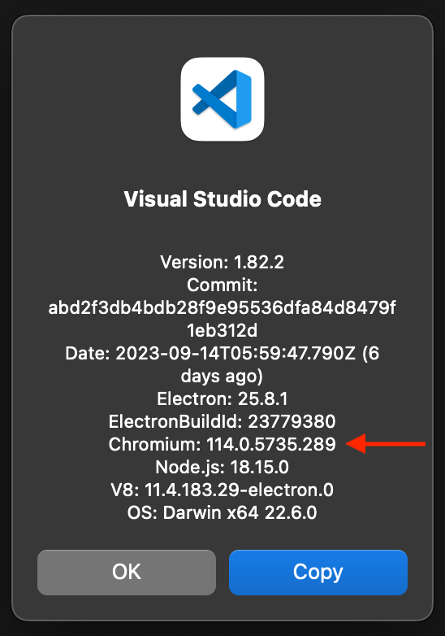
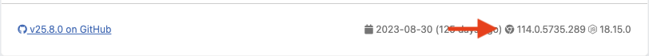

# VS Code version

The CodeQL for VS Code extension specifies the versions of VS Code that it is compatible with. VS Code will only offer to install and upgrade the extension when this version range is satisfied.

## Where is the VS Code version specified

1. Hard limit in [`package.json`](https://github.com/github/vscode-codeql/blob/606bfd7f877d9fffe4ff83b78015ab15f8840b12/extensions/ql-vscode/package.json#L16)

    This is the value that VS Code understands and respects. If a user does not meet this version requirement then VS Code will not offer to install the CodeQL for VS Code extension, and if the extension is already installed then it will silently refuse to upgrade the extension.

1. Soft limit in [`extension.ts`](https://github.com/github/vscode-codeql/blob/606bfd7f877d9fffe4ff83b78015ab15f8840b12/extensions/ql-vscode/src/extension.ts#L307)

    This value is used internally by the CodeQL for VS Code extension and is used to provide a warning to users without blocking them from installing or upgrading. If the extension detects that this version range is not met it will output a warning message to the user prompting them to upgrade their VS Code version to ge the latest features of CodeQL.

## When to update the VS Code version

Generally we should aim to support as wide a range of VS Code versions as we can, so unless there is a reason to do so we do not update the minimum VS Code version requirement.
Reasons for updating the minimum VS Code version include:

- A new feature is included in VS Code. We may want to ensure that it is available to use so we do not have to provide an alternative code path.
- A breaking change has happened in VS Code, and it is not possible to support both new and old versions.

Also consider what percentage of our users are using each VS Code version. This information is available in our telemetry.

## How to update the VS Code version

To provide a good experience to users, it is recommented to update the `MIN_VERSION` in `extension.ts` first and release, and then update the `vscode` version in `package.json` and release again.
By staggering this update across two releases it gives users on older VS Code versions a chance to upgrade before it silently refuses to upgrade them.

When updating the minimum version in `package.json`, you should also follow the additional steps listed below.

### Updating the Chromium target version

For the webview code, we use [esbuild](https://esbuild.github.io/) to bundle the code. This requires a target version of Chromium to be specified.
This version should be the same as the version of Chromium that is bundled with the new minimum VS Code version. There are two
methods to find this version.

#### Using the About Visual Studio Code dialog

Download the new minimum VS Code version from [the previous release versions](https://code.visualstudio.com/docs/supporting/faq#_previous-release-versions). Then,
select "About Visual Studio Code" from the top menu. This will show the version of Chromium that is bundled with that version of VS Code.



In this case, the `target` would be `chrome114`.

#### Using the VS Code source code

You can find the version of Electron that VS Code uses by looking at its `package.json` file for a specific version
(for example [the `package.json` for `1.82.0`](https://github.com/microsoft/vscode/blob/1.82.0/package.json#L153)).


Then, you can find the version of Chromium that is bundled with that version of Electron by looking at the
Chromium version that is shown for that Electron version on [the Electron releases site](https://releases.electronjs.org/releases/stable)
(for example [the `25.8.0` release](https://releases.electronjs.org/release/v25.8.0)):



In this case, the `target` would be `chrome114`.

#### Troubleshooting

In case there's an error when specifying a version of Chromium, you may need to update the version of `caniuse-lite`
in `package.json` to a newer version. You should be able to do so by running:

```shell
npx update-browserslist-db@latest
```

## VS Code version used in tests

Our integration tests are currently pinned to use an older version of VS Code due to <https://github.com/github/vscode-codeql/issues/2402>.
This version is specified in [`jest-runner-vscode.config.base.js`](https://github.com/github/vscode-codeql/blob/d93f2b67c84e79737b0ce4bb74e31558b5f5166e/extensions/ql-vscode/test/vscode-tests/jest-runner-vscode.config.base.js#L17).
Until this is resolved this will limit us updating our minimum supported version of VS Code.
