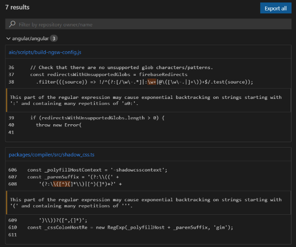
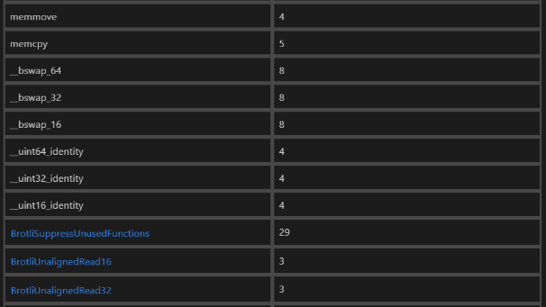

# Test Plan

This document describes the manual test plan for the QL extension for Visual Studio Code.

The plan will be executed manually to start with but the goal is to eventually automate parts of the process (based on 
effort vs value basis).

#### What this doesn't cover
We don't need to test features (and permutations of features) that are covered by automated tests.

### Before releasing the VS Code extension
- Go through the required test cases listed below
- Check major PRs since the previous release for specific one-off things to test. Based on that, you might want to 
choose to go through some of the Optional Test Cases.
- Run a query using the existing version of the extension (to generate an “old” query history item)

## Required Test Cases

### Test Case 1: Running a problem path query and viewing results

1. Open the [UnsafeJQueryPlugin query](https://github.com/github/codeql/blob/main/javascript/ql/src/Security/CWE-079/UnsafeJQueryPlugin.ql).
2. Run it against the following repo list:
```
"test-repo-list": [
    "angular-cn/ng-nice",
    "apache/hadoop",
    "apache/hive"
]
```
3. Check the notification message. It should:
   - Show the number of repos that are going to be queried
   - Provide a link to the actions workflow
4. Check the query history. It should:
   - Show that an item has been added to the query history
   - The item should be marked as “in progress”.
5. Once the query completes:
   - Check that a notification is shown with a link to the results view 
   - Check the results view 
   - Check the code paths view, including the code paths drop down menu. 
   - Check that the repository filter box works
   - Click links to files/locations on GitHub.

### Test Case 2: Running a problem query and viewing results

1. Open the [ReDoS query](https://github.com/github/codeql/blob/main/javascript/ql/src/Performance/ReDoS.ql).
2. Run it against the "Top 10" repositories.
3. Check the notification message. It should:
   - Show the number of repos that are going to be queried
   - Provide a link to the actions workflow
4. Check the query history. It should:
   - Show that an item has been added to the query history
   - The item should be marked as “in progress”.
5. Once the query completes:
   - Check that a notification is shown with a link to the results view
   - Check that the results are rendered with an alert message and a highlighted code snippet:


### Test Case 3: Running a non-problem query and viewing results

1. Open the [FunLinesOfCode query](https://github.com/github/codeql/blob/main/cpp/ql/src/Metrics/Functions/FunLinesOfCode.ql).
2. Run it against a single repository (e.g. `google/brotli`).
3. Once the query is complete:
   - Open the query results
   - Check that the results show up in a table:


### Test Case 4: Interacting with query history

1. Click a history item (for MRVA):
   - Check that exporting results works
   - Check that sorting results works
   - Check that copying repo lists works 
2. Open the query directory (containing results):
   - Check that the correct directory is opened and there are results in it
3. Open variant analysis on GitHub
   - Check that the correct workflow is opened

### Test Case 5: Cancelling a variant analysis run

When running one of the above queries, try cancelling one from within VS Code:
- Check that the query is cancelled and the query history item is updated.
- Check that the workflow run is also cancelled. 
- Check that any available results are visible in VS Code.

### Test Case 6: Change to a different colour theme 

When running one of the above queries, try changing to a different colour theme 
and check that everything looks sensible. Are there any components that are not showing up?

## Optional Test Cases

### 1. Selecting repositories to run on

#### Test case 1: Running a query on a single repository
1. When the repository exists and is public 
   1. Has a CodeQL database for the correct language 
   2. Has a CodeQL database for another language 
   3. Does not have any CodeQL databases
2. When the repository exists and is private
   1. Is accessible and has a CodeQL database
   2. Is not accessible
3. When the repository does not exist

#### Test case 2: Running a query on a custom repository list
1. The repository list is non-empty
   1. All repositories in the list have a CodeQL database 
   2. Some but not all repositories in the list have a CodeQL database
   3. No repositories in the list have a CodeQL database
2. The repository list is empty

#### Test case 3: Running a query on a built-in repository list (i.e. topN)
- Check that the query runs and results are shown

#### Test case 4: Running a query on all repositories in an organization
1. The org exists
  1. The org contains repositories that have CodeQL databases
  2. The org contains repositories of the right language but without CodeQL databases
  3. The org contains repositories not of the right language
  4. The org contains private repositories	that are inaccessible
2. The org does not exist

### 2. Using different types of controller repos
1. The controller is public 
  1. Can run queries on public repositories
  2. Can not run queries on private repositories
2. The controller is private
  1. Can run queries on public repositories
  2. Can run queries on private repositories
3. The controller repo exists but you do not have write access
4. The controller repo doesn’t exist
5. The “config field” for the controller repo is not set

### 3. Query History
1. Query history is loaded when vscode starts
- Handles when action workflow was cancelled while vscode was closed
- Starts monitoring variant analyses
  - When variant analysis state is “pending”
  - When variant analysis state is “in_progress”
  - When variant analysis state is “succeded”
    - All results are downloaded
    - Not all results are downloaded
  - When variant analysis state is “failed”
    - Stops monitoring
2. Can open query history item
- Manually by clicking on them
- Automatically when vscode starts (if they were open when vscode was last used)
3. Can delete a query history item
- Item is removed from list in UI
- Files on dist are deleted (can get to files using “open query directory”)
4. Can sort query history items
- By name
- By query date
- By result count
5. Can open query directory
6. Can open query that produced these results
- When the file still exists and has not moved
- When the file does not exist
7. Can open variant analysis on github
- Option is not shown before an actions run has been scheduled
- Option is shown when an actions run has been scheduled
8. Can copy repository list
- Option is not shown before all analyses have finished
- Option is shown once all analyses are finished
- Text is copied to clipboard
- Text is a valid repository list
9. Can export results
- Option is not shown before all analyses have finished
- Option is shown once all analyses are finished
10. Can select to create gist
- A gist is created
- The first thing in the gist is a summary
- Contains a file for each repository with results
- A popup links you to the gist
11. Can select to save as markdown
- A directory is created on disk
- Contains a summary file
- Contains a file for each repository with results
- A popup allows you to open the directory
12. Can cancel analysis
- Option is shown when analysis is in progress
- Option is not shown once all analyses are finished
- Option is not shown before action run has been started
- Causes the actions run to be cancelled

### 4. Results view
1. Can open a results view
- When variant analysis state is “pending”
- When variant analysis state is “in_progress”
- When variant analysis state is “succeeded”
- When variant analysis state is “failed”
- When variant analysis state is “canceled”
2. Results view opens automatically
- When starting variant analysis run
- When vscode opens (if view was open when vscode was closed)
3. Can copy repository list
See section from query history.
4. Can export results
- Only includes repos that you have selected (also see section from query history)
5. Can cancel analysis (see section from query history)
6. Can open query file (see section from query history)
7. Can open query text
8. Can view logs when variant analysis in final state (succeeded/failed/cancelled)
9. Can sort repos
  - By name
  - By results
  - By stars
  - By last commit
10. Can filter repos
11. Shows correct statistics
  - Total number of results
  - Total number of repositories
  - Duration
13. Can see live results
  - Results appear in extension as soon as each query is completed
14. Can view interpreted results (i.e. for a “problem” query)
  - Can view non-path results
  - Can view code paths for “path-problem” queries
15. Can view raw results (i.e. for a non “problem” query)
  - Renders a table
16. Can see skipped repositories 
  - Can see repos with no db in a tab
    - Shown warning that explains the tab
  - Can see repos with no access in a tab
    - Shown warning that explains the tab
  - Only shows tab when there are skipped repos
17. Result downloads
  - All results are downloaded automatically
  - Download status is indicated by a spinner (Not currently any indication of progress beyond “downloading” and “not downloading”)
  - Only 3 items are downloaded at a time
  - Results for completed queries are still downloaded when
    - Some but not all queries failed
    - The variant analysis was cancelled after some queries completed

### 5. Upgrading from non-live to live results

1. When you have an existing non-live remote query history item
  - Still opens the the non-live results view
2. When you have a local query history item

### 6. Downgrading from live to non-live results

1. When you have live results query history items
  - Can still open existing live results query history items. 
  This depends on the version you downgrade to, 1.7.6 works, but 1.6.12 doesn’t work because of an unsupported query history format
2. New queries will be non-live remote queries

### 7. Is all copy / text correct?
- In prompts when running a query
- In query history
- In results view
